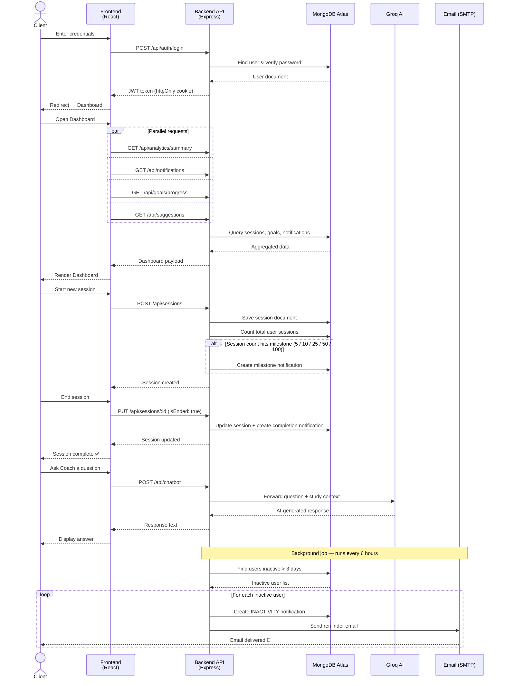

# Learning Tracker

A full-stack web application for tracking personal study sessions, managing learning goals, and gaining insights through analytics and AI coaching.

---

## Architecture — Sequence Diagram



---

## Tech Stack

**Frontend**
- React 19, React Router v7, Vite
- Axios, Lucide React, React Icons

**Backend**
- Node.js, Express 5
- MongoDB, Mongoose
- JWT Authentication, Passport.js (Google OAuth2)
- Nodemailer (SMTP), Groq SDK (AI)

---

## Features

- **Dashboard** — Weekly study activity, streaks, focus score, smart suggestions
- **Sessions** — Log and manage study sessions with subject, duration, and focus level
- **Goals** — Set study hour targets with start/end dates and track progress
- **Analytics** — Heatmap, focus score trends, study summaries
- **Coach** — AI-powered study coaching via Groq
- **Notifications** — Real-time bell with dynamic notifications based on sessions and goals
- **Inactivity Alerts** — Automated email reminders after 3 days of no activity
- **Google OAuth** — Sign in with Google
- **Responsive** — Mobile and tablet support

---

## Project Structure

```
learning/
├── Backend/
│   ├── src/
│   │   ├── config/         # DB, email, passport
│   │   ├── controllers/    # Business logic
│   │   ├── jobs/           # Inactivity scheduler
│   │   ├── middleware/     # Auth middleware
│   │   ├── models/         # Mongoose schemas
│   │   ├── routes/         # Express routes
│   │   └── utils/          # Helpers
│   ├── server.js
│   └── .env
└── frontend/
    ├── src/
    │   ├── components/     # AppLayout, NotificationBell, ChatBot, ...
    │   ├── context/        # AuthContext
    │   ├── pages/          # Dashboard, Sessions, Goals, Analytics, Coach, Profile, ...
    │   └── services/       # Axios API instance
    └── index.html
```

---

## Getting Started

### Prerequisites

- Node.js >= 18
- MongoDB (local or Atlas)
- Gmail account with App Password for SMTP

---

### 1. Clone the repository

```bash
git clone <repository-url>
cd learning
```

---

### 2. Backend setup

```bash
cd Backend
npm install
```

Create a `.env` file in `Backend/`:

```env
PORT=5000
MONGO_URI=mongodb+srv://<username>:<password>@cluster0.xxxxx.mongodb.net/learning_tracker?retryWrites=true&w=majority&appName=Cluster0
JWT_SECRET=your_jwt_secret_here
JWT_EXPIRES_IN=7d

CLIENT_URL=http://localhost:5173
SESSION_SECRET=your_session_secret_here

# Google OAuth2 (optional)
GOOGLE_CLIENT_ID=your_google_client_id
GOOGLE_CLIENT_SECRET=your_google_client_secret
GOOGLE_CALLBACK_URL=http://localhost:5000/api/auth/google/callback

# SMTP Email (Gmail App Password)
SMTP_HOST=smtp.gmail.com
SMTP_PORT=587
SMTP_USER=your_email@gmail.com
SMTP_PASS=your_app_password
MAIL_FROM=your_email@gmail.com

# Inactivity Scheduler
SCHEDULER_INTERVAL_SECONDS=21600    # Check every 6 hours
INACTIVITY_MINUTES=4320             # Alert after 3 days of no study
REMINDER_INTERVAL_MINUTES=1440      # Re-send at most once per day

# AI Coach (Groq)
GROQ_API_KEY=your_groq_api_key
```

Start the backend:

```bash
npm run dev       # development (nodemon)
npm start         # production
```

Backend runs on `http://localhost:5000`

---

### 3. Frontend setup

```bash
cd frontend
npm install
```

Create a `.env` file in `frontend/`:

```env
VITE_API_URL=http://localhost:5000/api
```

Start the frontend:

```bash
npm run dev
```

Frontend runs on `http://localhost:5173`

---

## API Endpoints

### Auth
| Method | Endpoint | Description |
|--------|----------|-------------|
| POST | `/api/auth/register` | Register |
| POST | `/api/auth/login` | Login |
| POST | `/api/auth/logout` | Logout |
| GET | `/api/auth/google` | Google OAuth |

### Sessions
| Method | Endpoint | Description |
|--------|----------|-------------|
| GET | `/api/sessions` | List sessions (paginated) |
| POST | `/api/sessions` | Create session |
| PUT | `/api/sessions/:id` | Update session |
| DELETE | `/api/sessions/:id` | Delete session |

### Goals
| Method | Endpoint | Description |
|--------|----------|-------------|
| GET | `/api/goals` | List goals |
| GET | `/api/goals/progress` | Goal progress |
| POST | `/api/goals` | Create goal |
| PUT | `/api/goals/:id` | Update goal |
| DELETE | `/api/goals/:id` | Delete goal |

### Notifications
| Method | Endpoint | Description |
|--------|----------|-------------|
| GET | `/api/notifications` | Get notifications |
| POST | `/api/notifications/generate` | Generate from real data |
| PUT | `/api/notifications/read-all` | Mark all as read |
| PUT | `/api/notifications/:id/read` | Mark one as read |

### Analytics
| Method | Endpoint | Description |
|--------|----------|-------------|
| GET | `/api/analytics/summary` | Study summary |
| GET | `/api/analytics/heatmap` | Activity heatmap |
| GET | `/api/analytics/focus-score` | Focus score history |

---

## Notification System

Notifications are generated dynamically from real user data via `POST /api/notifications/generate`. Triggered scenarios include:

- Session completed (subject name, duration, date)
- Study streak (consecutive days)
- Session count milestones (5, 10, 25, 50, 100+)
- Focus level improvement
- Goal progress (50%, 80%, 100%)
- Goal deadline warnings (≤ 3 days remaining)
- Inactivity warning (no session for 2+ days)

Automatic triggers fire when:
- A session is marked as ended → completion notification
- Session count hits a milestone → milestone notification
- Inactivity scheduler runs → email + in-app notification

---

## Migrating from MongoDB Compass to MongoDB Atlas

### 1. Create an Atlas account & cluster

1. Go to [mongodb.com/cloud/atlas](https://www.mongodb.com/cloud/atlas) → **Sign up / Log in**
2. Create a new project → **Build a Database** → choose **Free (M0)**
3. Select a cloud provider and region → **Create Cluster**

---

### 2. Configure access

**Database User:**
- Go to **Security → Database Access** → **Add New Database User**
- Set a username and password → Role: **Read and write to any database** → **Add User**

**Network Access:**
- Go to **Security → Network Access** → **Add IP Address**
- Click **Allow Access from Anywhere** (`0.0.0.0/0`) for development, or add your specific IP for production

---

### 3. Get the connection string

- Go to **Database → Connect** → **Drivers**
- Select **Node.js** → Copy the connection string, e.g.:
```
mongodb+srv://<username>:<password>@cluster0.xxxxx.mongodb.net/?retryWrites=true&w=majority
```
- Replace `<username>` and `<password>` with your Database User credentials

---

### 4. Export data from local MongoDB

Open a terminal and run:

```bash
mongodump --uri="mongodb://localhost:27017/learning_tracker" --out=./backup
```

This creates a `backup/learning_tracker/` folder with all collections.

---

### 5. Import data to Atlas

```bash
mongorestore --uri="mongodb+srv://<username>:<password>@cluster0.xxxxx.mongodb.net/learning_tracker" ./backup/learning_tracker
```

Verify the import in Atlas → **Browse Collections**.

---

### 6. Update `.env`

In `Backend/.env`, replace the local URI:

```env
# Before (local)
MONGO_URI=mongodb://localhost:27017/learning_tracker

# After (Atlas)
MONGO_URI=mongodb+srv://<username>:<password>@cluster0.xxxxx.mongodb.net/learning_tracker?retryWrites=true&w=majority
```

Restart the backend — it will now connect to Atlas.

---

## Environment Variables Reference

| Variable | Required | Description |
|----------|----------|-------------|
| `MONGO_URI` | Yes | MongoDB connection string |
| `JWT_SECRET` | Yes | Secret for JWT signing |
| `CLIENT_URL` | Yes | Frontend URL (for CORS) |
| `SMTP_USER` | No | Gmail address for sending emails |
| `SMTP_PASS` | No | Gmail App Password |
| `GROQ_API_KEY` | No | API key for AI coach feature |
| `GOOGLE_CLIENT_ID` | No | Google OAuth client ID |
| `GOOGLE_CLIENT_SECRET` | No | Google OAuth client secret |
| `INACTIVITY_MINUTES` | No | Minutes before inactivity alert (default: 4320) |
| `SCHEDULER_INTERVAL_SECONDS` | No | Scheduler check interval (default: 21600) |
| `REMINDER_INTERVAL_MINUTES` | No | Min interval between reminder emails (default: 1440) |
